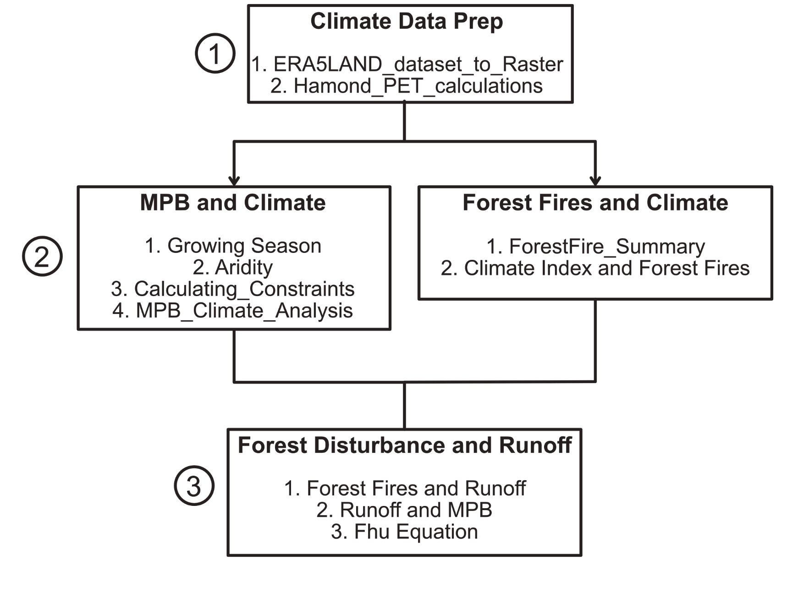

## Introduction
This repository contains code used to manipulate ERA5-land climate data1 and produce results for the Vore et. al (2020) paper currently under review in the journal Hydrological Processes. The manuscript explores the relationship between climate, forest fires, mountain pine beetle (MPB) outbreaks, and runoff in eight interior British Columbia, Canada watersheds from 1981-2019. 

## Files
All code is presented in Jupyter Notebook files written in Python. Files are organized by their relevancy in the manuscript, with the flow chart below showing the order in which files should be run to replicate our work. 

## Individual File Descriptions
**ERA5LAND_dataset_to_Raster.ipynb** --> This code takes hourly ERA5-land datasets and turns them into rasters. The code can input the following variables: total precipitation, 2m temperature, runoff, evapotranspiration, snow cover, snow depth, and potential evapotranspiration. After rasters have been created, they are snipped using watershed shapefile boundaries with the climate variable being totaled/averaged over the basin's area.

**Hamond_PET_Calc.ipynb** --> This code uses daily temperature averages to calculate the potential evapotranspiration (PET) of a watershed. A maximum and minimum PET was calculated using K=1.2 and K=1.42

**Aridity.ipynb** --> This code uses yearly potential evapotranspiration and precipitation totals to determine the aridity of a watershed for each year. The aridity results are used in calculating the constants in the Safranyik et al. (1975) model3.

**Growing_Season.ipynb** --> This code calculates the last day where minimum air temperatures dip below -1 in the spring and the day where min temperatures fall below -1 in the fall. The timespan between freezing temperatures are used to define the average growing season. One growing season parameter is calculated for each watershed. The results are used when calculating constraints in the Safranyik et al. (1975) model3.

**Calculating_Constraints.ipynb** --> This code calculates the constraints C1-C4 in the Safranyik et al. (1975) model3 (Table 2 in Vore et al (2020)). This code takes the precipitation and temperature data for each year and creates a binary rasters (1 if the constraint is met, 0 if it is not met) for C1, C3, and C4. For constraint C2, the code counts the number of cold days each year for each grid cell and creates a count Raster, identifying how many days the minimum temperature fell below -40C. A raster for each year and constraint is created. 

**MPB_Climate_Analysis.ipynb**--> This code uses all the outputs calculated in Aridity, Growing_Season, and Calculating_Constraints to plot the relationship between MPB climate suitability classes (CSCs) and MPB outbreaks themselves. The code can be run for different time-intervals (in the manuscript it mentions 5, 10, and 15-year analysis).

**ForestFire_Summary.ipynb** --> Creates a summary of forest fire events in each watershed since 1981 from the Government of British Columbia data5.

**Climate Index and Forest Fires.ipynb** --> This code creates a climate index from normalized precipitation anomalies (NPA) and normalized temperature anomalies(NTA). Climate index trends are calculated and plots showing the relationship between forest fire size and the climate index are produced for multiple seasons and years. 

**Forest Fires and Runoff.pynb** --> This code summarizes runoff/precipitation (R/P) and normalized precipitation anomalies (NPA) for 3 years pre- and post- forest fire events. Normalized R/P anomalies are calculated and the extreme R/P events (those that exceed the 95th percentile of data) are determined. These extreme R/P events are then compared to NPA to determine if they fall within the data distribution. 

**Runoff and MPB.ipynb** --> This code calculates the normalized R/P anomalies for each year on record  and looks at linear trends of the runoff data during and before MPB outbreak. Subsets of the data are determined based on minimal changes in logging and forest fire ECA, with linear trends calculated for each subset. 

**Fhu Equation.ipynb** --> This code calculates the average m and P/PET for each of our watersheds, according to Fhu's equation2. The findings of these calculations are compared with the conclusions made in Zhou et al. (2015).

## Data
**Climate_Monthly_Summary.xlsx** --> This contains monthly climate statistics calculated from ERA5-land hourly data1 for each of our watersheds from 1981-2019 as  well as observed runoff data from Environment and Climate Change Canada 4.  

**ERA5_land_Climate_Index.xlsx** --> This contains the normalized precipitation anomalies (NPA) and normalized temperature anomalies (NTA) for each watershed from 1981-2019 for each season (annual, spring, summer, fall, winter).

**Fire_Summary_by_watershed.zip**--> This zip folder contains the fire summary for each watershed since 1981 as determined from the Government of British Columbia historical fire preimeter database 5.

## References
1 Copernicus Climate Change Service (C3S) (2019). ERA5-Land hourly data from 1981 to present. Copernicus Climate Change Service. https://doi.org/10.24381/cds.e2161bac

2 Zhou, G., Wei, X., Chen, X., Zhou, P., Liu, X., Xiao, Y., … Su, Y. (2015). Global pattern for the effect of climate and land cover on water yield. Nature Communications, 6, 5918. https://doi.org/10.1038/ncomms6918

3 Safranyik, L., Shrimpton, D. M., & Whitney, H. S. (1975). An interpretation of the interaction between lodgepole pine, the mountain pine beetle, and its associated blue stain fungi in western Canada. Management of Lodgepole Pine Ecosystems Symposium Proceedings, 406–428. http://scholar.google.com/scholar?hl=en&btnG=Search&q=intitle:No+Title#0

4 Environment and Climate Change Canada. (2020). National Water Data Archive: HYDAT. https://www.canada.ca/en/environment-climate-%0Achange/services/water-overview/quantity/monitoring/survey/data-products-%0Aservices/national-archive-hydat.html

5 Government of British Columbia. (2019b). Fire Perimeter- Historical. Ministry of Forests, Lands, Natural Resource Operations and Rural Development. https://catalogue.data.gov.bc.ca/dataset/fire-perimeters-historical

